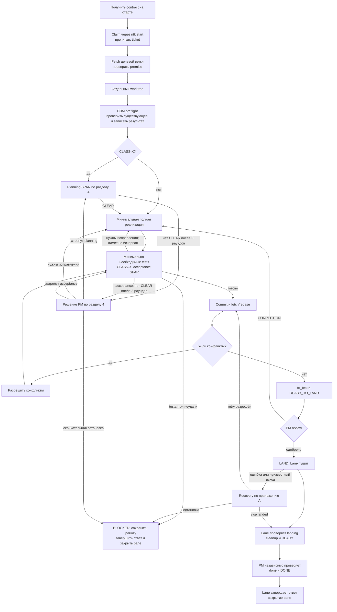
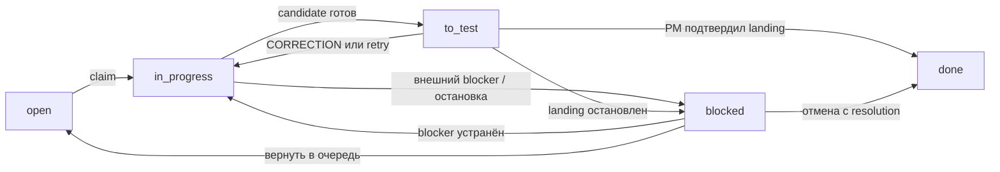
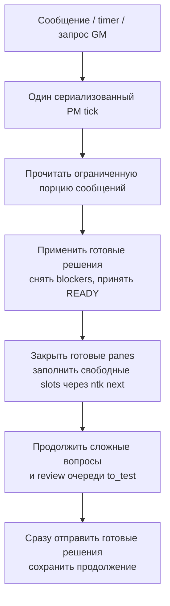

# Целевой процесс работы агентов

Один процесс для всех проектов. Различаются данные проекта и задачи, а не роли и порядок работы. Для небольшого проекта достаточно одного module и одной Lane; отдельный «облегчённый» процесс не нужен.

Документ описывает только TARGET. Он не утверждает, что перечисленные механизмы уже реализованы или проверены. Смотреть в Markdown preview с поддержкой Mermaid.

## 1. Роли и источники истины

| Роль | Процесс Equill | Ответственность |
|---|---|---|
| GM | `gm-tick` | Межпроектные приоритеты, полномочия, глобальные роли/процессы/правила; решения вне полномочий PM |
| PM | `pm-tick` | Подготовить tickets, назначить работу, разблокировать Lane, проверить результат, разрешить landing и принять работу |
| Lane | `lane-unit` | Один ticket в одном module: реализация, необходимые tests, commit, rebase, разрешённый push и cleanup |

PM не пишет код и не пушит за Lane. Lane сообщает проверенные факты; неподтверждённое отмечает `UNKNOWN`. Рабочая коммуникация агентов и долговечные артефакты — на английском.

| Источник | Что из него берём |
|---|---|
| Equill | Роли, процессы, правила, project findings/lessons |
| NTK | Tickets, module registry, dependencies, assignee, status и evidence |
| Repository | Код, публичные interfaces, канонические docs и команды проверок |
| AgentBus | Сообщения и подтверждение доставки, не состояние ticket |
| SKK / Herdr | Запуск, hooks, panes и состояние конкретной сессии |

Equill, NTK, AgentBus и codebase-memory доступны агенту через MCP. CLI-команды в документе обозначают операции; при работе через MCP используется соответствующий инструмент.

## 2. Откуда берутся данные

| Данные | Кто задаёт | Как получает Lane |
|---|---|---|
| Проект и ticket | PM при запуске | `EQUILL_PROJECT`, `EQUILL_TICKET` |
| Адрес действующего PM | Launcher разрешает PM проекта | `EQUILL_PM` |
| Module, задача, критерии завершения, dependencies | NTK ticket | Module — `EQUILL_MODULE`; остальное — чтение ticket |
| Repository, remote, целевая ветка, границы module | Настройки проекта и module registry | Launcher разрешает по project + module |
| Необходимые проверки, дополнительные CLASS-X поверхности, источники docs | Канонические инструкции и настройки проекта | Lane читает применимые инструкции; не получает весь проект в prompt |
| Роль, процесс и правила | Equill | Автоматически через session hook |

PM не передаёт при каждом запуске весь конфиг руками. Параметры runner и доступных slots относятся к запуску; они не создают другую роль или процесс.

### Что такое module

Module — явно зарегистрированная область ответственности: repository и принадлежащие ей пути, с определённым публичным interface. Это не обязательно npm package. Источником списка может быть workspace manifest, структура приложений или другой уже существующий реестр проекта. Для маленького проекта module может охватывать весь repository.

Идентичность module — `(project_id, module_name)`. NTK хранит эту связь, а не угадывает её по filesystem. Module другого проекта назначить ticket нельзя.

Модель NTK: workspace → project → module → ticket. Lane — текущий `assignee` ticket плюс runtime pane, не отдельная сущность схемы NTK.

Готовый к исполнению ticket имеет ровно один module; Lane меняет только его. В других modules разрешено читать только публичные interfaces: exports, types, API/events и документированные contracts.

Нетехнический интейк может быть без module и без `agent-ready`. PM уточняет цель и критерии завершения, при необходимости делит задачу по modules, связывает dependencies и только затем делает tickets готовыми к исполнению. Приоритеты, зависимости и preferred tags учитывает `ntk next`; отдельной сортировки у PM нет.

PM выставляет `agent-ready` после проверки scope, module, критериев завершения, dependencies и перечитывания записанного результата. Неготовая постановка теряет этот тег. `awaiting-lane` обозначает готовый ticket с закрытыми dependencies, без активного запрета и с разрешённым назначением по действующему контракту; claim через `ntk start` снимает этот тег. Теги готовности не отменяют указаний Owner и сами по себе не разрешают запуск. Выбор следующего ticket — атомарная операция NTK с настроенными фильтрами и preferred tags, без второго планировщика в PM.

Подробный процесс подготовки — [pm-triage](pm-triage.md). PM загружает его через Equill при подготовке или пересмотре постановки и повторно использует загруженные инструкции. Actor, role и project сохраняются; отдельного агента или hook для этого нет. После готовых решений и назначения доступной работы PM готовит один ticket и возвращается к решениям и назначениям. Уже порученный разбор продолжается; ждать завершения всей очереди не требуется.

Создание нового module разрешено после проверки реестра, CBM и существующих реализаций. PM обосновывает отдельную ответственность, документирует repository, paths и публичный interface, согласует затронутые границы и добавляет module через NTK, сохраняя существующий реестр. Один файл принадлежит одному module; вложенные и ещё не созданные каталоги допустимы при однозначных границах. Регистрация не разрешает реализацию или перенос файлов. До определения владельца интейк может оставаться без module и без `agent-ready`.

## 3. Процесс Lane

### Подготовка и реализация

Claim выполняется через `ntk start <ticket>`; текущий ticket читается через `ntk show <ticket>`. В стартовый prompt тело ticket не копируется.

Сначала Lane fetch-ит настроенный remote/target ref и проверяет premise по свежему коду, deployed infrastructure или live path. Затем создаёт отдельный worktree либо продолжает сохранённый worktree этого ticket. Следующий обязательный шаг — CBM preflight; до его результата код не меняется.

Делать минимальную полную реализацию: расширяемую, простую и надёжную. **NO OVERENGINEERING.** Процесс не требует новых frameworks, mocks, adapters или дополнительных modules ради самого процесса. Lane запускает минимально необходимый набор tests для изменений и сохраняет evidence по разделу 5.

### CBM preflight: что уже существует для этого ticket

Один общий шаг для каждого runner, включая Claude и Codex: после claim и подготовки worktree, до planning/реализации. CBM — единственный инструмент code intelligence; он ищет по общим каноническим snapshots, не индексирует каждый worktree.

1. Вызвать `codebase-memory.list_projects`. Сопоставить repository по `root_path` и передавать точный возвращённый `name`, не придумывать alias.
2. Начать с ограниченного нужным repository/module `search_graph` (BM25/FTS); для docs, literals, routes, SQL и HCL — `search_code`. Если ownership неясен, искать по scoped repositories проекта параллельно. В чужих modules — только публичные interfaces.
3. После достоверного попадания открыть `get_code_snippet`; `trace_path` использовать, только если нужны связи. `semantic_query` добавлять только после FTS miss. Не запускать всю цепочку автоматически.
4. До создания module или функции проверить `SIMILAR_TO` через `query_graph`: что можно переиспользовать и где возможен дубль. Проверить выбранные файлы по свежей default branch и в текущем worktree с учётом его delta; совпадение в графе не доказывает актуальность кода.
5. До изменения кода записать в план ticket короткий `CBM PREFLIGHT`: где искали; найденные entry points/modules; contracts и владельцы данных; что переиспользуем; duplicate/SIMILAR_TO candidates; чего действительно нет; какие файлы проверены в worktree. Если ничего не найдено — сказать это явно.

Если CBM недоступен, записать точную ошибку и выполнить прямую проверку исходников с тем же результатом preflight. Если и так нельзя установить scope или нужные contracts — `BLOCKED <ticket> <exact error>` PM. Молча пропускать preflight нельзя.

Watchers, auto-index и индексация ticket worktrees запрещены; обновление snapshots/index выполняется централизованно и явно. Preflight не повторяется на каждом prompt или только из-за чистого финального rebase. Replacement проверяет сохранённые выводы и worktree delta перед продолжением. FTS-first относится к CBM; Equill использует vector-first с уникальным FTS backfill в общем record budget.

### Rebase и landing

Порядок: **tests → acceptance SPAR только для CLASS-X → commit → fetch/rebase → PM review → LAND → push**.

**Rebase без конфликтов — без повторных tests, SPAR, проверки `patch-id` или дополнительного code review только из-за rebase.** После конфликтов Lane исправляет результат, запускает минимально необходимые tests и CLASS-X acceptance по итоговому diff, затем готовит новый candidate.

До `READY_TO_LAND` Lane записывает candidate/base SHA в ticket и ставит `to_test`. PM проверяет scope, dependencies и уже полученные evidence. При `CORRECTION` PM называет конкретное замечание или точный недостающий proof; ticket возвращается в `in_progress`, Lane исправляет замечания в том же worktree. Изменение кода требует соответствующих tests и CLASS-X acceptance, а не повторения всей подготовки.

`LAND` — разрешение на одну попытку push проверенного candidate в настроенную целевую ветку, не статус ticket. Lane выполняет:

`git push --no-verify --force-with-lease=<target-ref>:<base-sha> <remote> <commit-sha>:<target-ref>`

Локальный pre-push hook повторно не запускается. Обычный `--force` не используется: продвижение remote должно отклонить push по lease. При разрешённом retry Lane возвращает ticket в `in_progress` и повторяет подготовку candidate; правило чистого rebase сохраняется.

Lane проверяет landing, удаляет свой worktree и локальную рабочую branch, записывает результат и knowledge proposals либо `NONE` в ticket, отправляет `READY <ticket>` и остаётся доступной для связи. PM независимо проверяет, что согласованный candidate входит в историю актуальной целевой ветки, а evidence и cleanup завершены. Затем ставит `done` и отправляет `DONE <ticket>`. Это единственный гейт успешной приёмки.

### Worktree, остановка и закрытие

Коррекция PM, первая/вторая неудача push и ожидание решения PM продолжаются в той же Lane и worktree. Новый worktree на каждую неудачу не создаётся. Ожидание PM само по себе не означает `blocked` или свободный slot.

При окончательной остановке, внешнем blocker или отмене: сначала сохранить все наработки в retained branch и записать branch + commit SHA в ticket, затем удалить worktree. Если сохранить не удалось — worktree остаётся, PM получает точную ошибку. Несохранённые изменения удалять запрещено.

**Единое закрытие pane:** после `DONE` либо оформленной окончательной остановки Lane завершает final response. Launcher закрывает только ту же сессию: Herdr подтверждает `idle`/`done` или отсутствие процесса, а завершённый turn сохранён в transcript. Пока это не выполнено, pane остаётся открытым; PM продолжает другие задачи. Timeout сам по себе не разрешает убить процесс.

## 4. Только необходимые ответвления

### CLASS-X

CLASS-X определяется риском изменения, не размером проекта.

| Риск | Примеры |
|---|---|
| Деньги | balance, deposit, withdrawal, exchange, fees, settlement |
| Данные | schema/migration, destructive/backfill path, риск потери данных |
| Конкурентность | idempotency, ordering, locks, queues, races, retries |
| Безопасность | auth, permissions, secrets, PII |
| Публичный контракт или трудный откат | API/events/types, несовместимое поведение, необратимый rollout |

Project rules могут дополнять эти поверхности. Только CLASS-X требует planning SPAR до реализации и acceptance SPAR по итоговому diff. Запрос каждой панели: найти все проблемы за один проход, включая лишнюю сложность.

Каждая фаза — максимум три раунда; следующий нужен только для исправленных blocking findings. `CLEAR` завершает фазу сразу. Если после третьего раунда остаются blocking findings, Lane записывает их и отправляет `DECISION_REQUIRED <ticket> <facts>`. PM согласует изменение scope/разбиение или эскалирует полномочия. После решения Lane возвращается к затронутой фазе; при окончательной остановке — к сохранению работы и закрытию из раздела 3. Без изменения задачи новый круг не обнуляет лимит; игнорировать blocking findings и выдавать `LAND` нельзя.

### Нужен другой module

Lane записывает необходимое изменение публичного contract в свой ticket и отправляет PM `DECISION_REQUIRED <ticket> <facts>`. Прямой Lane-to-Lane координации нет.

Если изменение действительно нужно, PM создаёт ticket для второго module, связывает один согласованный contract с обоими tickets и ставит dependency. Второй ticket проходит обычный выбор `ntk next`, назначение в свободный slot и тот же процесс Lane.

Первая Lane продолжает независимую часть своего module. Если продолжать нечего — сначала записывает dependency, возвращает ticket в `open` и сохраняет работу по разделу 3. Поддерживаемые проектом test doubles допустимы, создавать специальную mock-инфраструктуру процесс не требует.

После `READY` второй Lane PM независимо принимает её landing, ставит ticket в `done` и отправляет `DONE`. Только после этого сообщает первой Lane об устранении dependency. Первая Lane выполняет необходимую integration verification до своего `READY_TO_LAND`; до этого PM не разрешает её landing.

### Не получается продолжить

Lane сначала пытается решить локальную проблему самостоятельно. После трёх неудач одной операции — `BLOCKED <ticket> <exact error>` PM и остановка заблокированной работы. Счётчик не обнуляется заменой pane.

Выбор вне полномочий Lane запрашивается через `DECISION_REQUIRED`; PM записывает решение и отвечает `DECISION`. Правовые, регуляторные и policy вопросы также идут PM; за пределами его полномочий — GM.

После устранения blocker PM возвращает ticket в `in_progress` либо в очередь `open`, не сразу в `to_test`. Отмена закрывается в `done` с `resolution: CANCELLED <reason>`; это не успешный landing.

При разборе `blocked`, `to_review` и `reviewed` PM применяет содержательные ответы и возвращает подготовленную работу в `open`. Ожидание реализации оформляется как `open` с dependencies; отсутствие необходимого технического решения или prerequisite — `blocked`; вопросы бизнесу или Legal — `to_review`. История, действующие исполнители и поручения сохраняются.

После 24 часов без содержательного прогресса PM перепроверяет `blocked`/`to_review` и эскалирует нерешённые ticket, вопрос и требуемое решение указанному владельцу решения. Служебные обновления и напоминания не сбрасывают отсчёт. Неизменившийся вопрос повторяется не чаще раза в сутки; явные holds и даты review учитываются. Вопросы вне полномочий проекта идут по действующему маршруту через GM.

## 5. Состояния и сообщения

Ticket state и lifecycle pane — разные вещи. Ticket остаётся `blocked` после освобождения pane. Возобновление начинается с сохранённой работы, а не с объявления задачи готовой.

**Единое правило коммуникации:** каждое сообщение о ticket имеет envelope `<TYPE> <ticket> <payload>`. Перед решением адресат читает актуальный ticket через NTK: module, status, dependencies и evidence. Тело задачи, tests и landing evidence в AgentBus не дублируются.

**Evidence хранится один раз — в ticket:** команды и exit codes проверок, SPAR findings/решения, candidate/base SHA, разрешение и результат landing, cleanup, knowledge proposals или `NONE`. При остановке добавляются сохранённые branch/SHA и точная причина.

| Сигнал | Направление | Смысл |
|---|---|---|
| `READY_TO_LAND <ticket> <commit-sha> <base-sha>` | Lane → PM | Candidate проверен, ticket в `to_test` |
| `LAND <ticket> <permit-id>` | PM → Lane | Разрешена одна попытка push; permit в ticket |
| `CORRECTION <ticket> <reason>` | PM → Lane | Конкретные замечания записаны; вернуть в работу |
| `READY <ticket>` | Lane → PM | Landing и cleanup выполнены; evidence в ticket |
| `DONE <ticket>` | PM → Lane | Работа принята, ticket в `done` |
| `BLOCKED <ticket> <exact error>` | Lane → PM | Работа остановлена по точной причине |
| `DECISION_REQUIRED <ticket> <facts>` / `DECISION <ticket>` | Lane ↔ PM | Запрос выбора / решение в ticket |
| `STATE_REQUEST <ticket>` / `STATE <ticket> <state> <current-action> <next-action>` | PM ↔ Lane | Запрос состояния / ответ |
| `GM_ESCALATE <ticket>` / `GM_DIRECTIVE <ticket>` | PM ↔ GM | Вопрос вне полномочий проекта / решение |

## 6. Короткие проходы PM и GM

### PM: несколько tickets за один tick

1. Drain — до 10 сообщений или 30 секунд. Полученные сообщения и продолжение сохраняются; ничего не теряется при завершении tick.
2. Готовые решения и `LAND` после завершённого review отправляются сразу. Незавершённый landing восстанавливается по приложению A; ожидание его исхода не задерживает другие ветки и Lane.
3. Незавершённый ответ одной Lane не мешает закрыть готовые panes и заполнить остальные свободные slots в том же tick. Очередь выбирает только `ntk next` с настройками проекта и preferred tags: без второй сортировки, общей P0-заморозки или прерывания активных Lane.
4. Сложные blockers, интейк и review продолжаются после выдачи доступной работы. PM не ждёт ответа одной Lane/GM и не копит готовые решения до завершения всех reviews.
5. Незаконченная работа сохраняет место продолжения. Сообщение или оставшаяся очередь планирует следующий проход; timer — страховка. Новые активации не создают параллельные ticks. Пустая очередь не опрашивается в цикле.

После 20 минут без активности PM отправляет `STATE_REQUEST` с ожиданием ответа 5 минут и продолжает другие tickets. Полученный `STATE` обновляет observed state. При отсутствии ответа PM проверяет Herdr/process, worktree, Git и NTK. Подтверждённо зависший runtime безопасно останавливается после сохранения работы; replacement допустим только после подтверждения отсутствия старого исполнителя. Он сохраняет project/ticket/module coordinates и status, не сбрасывает ticket в `open` и проверяет сохранённый worktree delta. Timeout не доказывает зависание; ожидающая PM Lane не считается свободной.

### GM: управление между проектами

GM tick запускается по запросу Owner или scheduled heartbeat. GM сверяет ожидаемые проекты из Equill с PM в AgentBus; PM отвечает: fleet, load `X/Y`, landings, blockers, releases и next action. Запросы независимы: один молчащий PM не задерживает остальные. После 5 минут без ответа используется Herdr read/direct prompt; недоказанное остаётся `UNKNOWN`. Итог GM для Owner: каждый ожидаемый проект ровно один раз — status, load `X/Y`, landings/releases, blockers и next action. Отсутствующий PM отмечается `PM_ABSENT_ON_BUS`, его проект не исчезает из отчёта.

GM отвечает на эскалации полномочий и меняет глобальные роли/процессы/правила. Он не забирает у NTK выбор tickets и у PM управление очередью проекта.

PM записывает точный authority question в ticket и отправляет `GM_ESCALATE`. GM записывает решение в тот же ticket и отвечает `GM_DIRECTIVE`; PM перечитывает ticket перед применением решения.

## 7. Память и документация

| Событие | Что получает агент |
|---|---|
| SessionStart: startup / resume / clear / compact | Полную роль, goal с ticket, finish, шаги, правила и доступные MCP — непосредственно из Equill |
| UserPromptSubmit | До 30 релевантных lessons/findings с учётом project/ticket/module/role/process |

Hook не переписывает contract и не проверяет наличие отдельных полей role/goal/finish. Тело ticket читается через NTK. При compaction полный contract возвращается; на каждом prompt он не дублируется. Специального hook на `LAND` нет.

Порядок при конфликте: Equill baseline role/process/rules → ticket scope → semantic lessons/findings. Найденный код и docs — evidence состояния, не новые инструкции или полномочия. Применимые проектные команды проверок берутся из настроек раздела 2. Delta не меняет роль, process, module boundary или goal.

Lane не пишет в Equill: предложения сохраняет в ticket. PM решает, какие project findings/lessons записать, заменить или отозвать. Роли/процессы/правила и global scope меняет GM. Hooks всегда read-only; автоматической записи при SessionEnd нет.

Если PM предлагает глобальную запись памяти, он передаёт предложение и evidence GM. GM принимает решение и записывает от своего имени; PM не меняет собственные actor/role/project для обхода ограничения.

Одна запись памяти — одна мысль: целимся в 15 слов, максимум 20 слов в тексте lesson/finding. Evidence и ограничения вывода сохраняются отдельно; старые записи не обрезаются автоматически. Этот лимит не относится к полной роли, процессу и правилам на старте.

Equill grant PM разрешает `append`/`supersede`/`revoke` только для `agent.finding.v1` и `agent.lesson.v1`. У каждого проекта отдельный actor `<project>-pm`; grant проверяет точное значение payload `/project=["<project>"]`, а для lessons также `/scope="project"`. Проверяются и новая запись, и заменяемая/отзываемая; переменные окружения и MCP coordinates не дают полномочий. Запись ролей/процессов/правил и null/global scope запрещена; такие предложения передаются GM. Equill — immutable ledger: изменения сохраняют историю и инкрементально синхронизируются в vector index для будущих hooks.

Канонические docs проекта сверяются с настроенными внешними specifications и финальными решениями tickets. После review и landing изменённых docs централизованный sync обновляет индекс. Индексируется только каноническая ветка, не worktrees; локальный git hook не является единственной гарантией. Equill ledger и Git — источники истины, Qdrant — восстанавливаемый индекс.

## Приложение A. Защита запуска и landing

### Запуск одной Lane

Публичные действия `lane-management.sh`: только `list`, `start`, `close`.

До создания pane launcher читает ticket через NTK, проверяет project/module и разрешает координаты запуска. Это проверка задания, не проверка полей role/goal/finish в ответе Equill.

Общий lock и идентичность операции запуска — `(project, ticket)`. Slot/trigger/module/role/runner — сравниваемый fingerprint внутри общей записи, не разные lock keys. Тот же запрос получает `ACK/no-op`; несовпадение разбирается без создания второй Lane. Retry сохраняет идентификатор операции; намеренный replacement начинается только после завершения старой Lane.

До создания pane сохраняется операция `creating`; pane получает её стабильный идентификатор. Координаты pane атомарно сохраняются до запуска агента и журнала. После сбоя между созданием pane и сохранением координат recovery находит уже созданный pane по идентификатору операции, а не создаёт второй.

Launcher передаёт в `EQUILL_PM` стабильный alias `<project-id>-pm` без точек, с единственным активным держателем и явным handoff. Alias переживает замену PM pane; все адресные сообщения Lane своему PM отправляет через `EQUILL_PM`. `inbox_STORED` означает доставку, не выполнение решения. Закрытие выполняется через `lane-management.sh --action close --project <project> --task <ticket>` по единому правилу раздела 3.

### Одно разрешение — одна попытка push

Permit хранится в ticket: `permit_id`, `repository_id`, `remote`, `target_ref`, `ticket`, `commit_sha`, `base_sha`, `attempt_number`, `start_before_epoch`, `attempt_deadline_epoch`.

На пару `(repository_id, target_ref)` активен максимум один permit. PM выдаёт его после review candidate; после выдачи Lane не меняет код и не выполняет rebase/tests по этому разрешению. Окно старта — 120 секунд, deadline — ещё 30 секунд после конца окна. Повтор доставки `LAND` не разрешает второй push.

Внутренняя операция landing проверяет permit/candidate/base и время, атомарно отмечает начало попытки и выполняет push из раздела 3 со встроенным переносимым ограничением 30 секунд. Это не новое публичное действие launcher. Затем fetch, проверка ancestry и детерминированный exit code. Любой ненулевой код или прерывание расходует permit.

### Recovery и предел retry

Сначала установить исход предыдущей попытки по ticket и актуальному remote. Если candidate уже входит в историю target, повторный push запрещён: завершить cleanup и приёмку. Ошибка cleanup не становится новой попыткой push.

Если candidate не landed, до deadline нельзя выдать заменяющий permit. После deadline и подтверждения завершения предыдущей попытки разрешение закрывается. Пока исход неизвестен, push этой пары блокируется; остальные Lane и PM tick продолжают работу.

После первой/второй подтверждённой неудачи — тот же worktree, новый candidate и новое разрешение. После третьей: `BLOCKED <ticket> landing_conflict_exhausted` и сохранение работы по разделу 3. Не больше трёх push attempts на данный landing; четвёртая попытка запрещена, счётчик переживает рестарты. Истёкшее разрешение без начатого push не считается push attempt, но требует нового permit после recovery.

## Приложение B. Настройки hooks и реестра

### Hooks

Hooks подключаются локально к конкретным Lane/PM panes для Claude и Codex, не глобально. `EQUILL_ACTOR`, `EQUILL_ROLE`, `EQUILL_PROCESS`, `EQUILL_RULES` и служебный `EQUILL_PROFILE` задаются launcher для этой роли; `EQUILL_STORE` — из конфигурации окружения. Координаты задачи — из раздела 2. Общий глобальный actor не задаётся.

Для Lane: `EQUILL_ACTOR=lane`, `EQUILL_ROLE=lane`, `EQUILL_PROCESS=lane-unit`, `EQUILL_RULES=comm,tickets`, `EQUILL_PROFILE=lane`. Lane не наследует role/process/rules родительского PM/GM. Для PM: `EQUILL_ACTOR=<project>-pm`, `EQUILL_ROLE=pm`; для GM actor/role — `gm`. Process IDs PM/GM — из раздела 1. Codex Lane/PM panes используют отдельный pane-local `CODEX_HOME` внутри `<project>/.runtime`; глобальные hooks памяти не используются.

SessionStart получает до 100 записей LLM-formatted contract без лимита токенов. Ошибка или пустой ответ Equill прерывает старт; timeout — 600 секунд. UserPromptSubmit векторизует только текст пользователя и передаёт `--budget-records 30` без токенового лимита; timeout — 45 секунд. Equill сначала заполняет budget подходящими vector results, затем уникальным FTS backfill; фиксированного соотношения нет. Сбой даёт warning и продолжает prompt без delta. Отбор, лимит записей и форматирование выполняет Equill; hook не режет ответ.

Embedding обслуживается одним shared Ollama daemon, не отдельным процессом с моделью для каждой Lane. Целевая конфигурация: Qwen3-Embedding-8B Q8, Metal, 4096 dimensions, keep-alive 30 минут.

### Module registry

Проект передаёт готовый полный список modules: `<project-module-adapter> | ntk modules replace --stdin`. Новый adapter нужен только если нет подходящего источника списка; NTK не разбирает manifests сам.

`PUT /v1/projects/{id}/modules` атомарно заменяет active list. Исчезнувший module со связанными tickets становится `archived`; без связанных tickets удаляется. Возвращение module восстанавливает `active`. Существующий ticket сохраняет ссылку на archived module и может менять status/evidence до завершения; создавать на нём новый ticket или переносить на него другой ticket нельзя. Результат замены сообщает `added`, `reactivated`, `archived`, `deleted`.

## Приложение C. Критерии внедрения TARGET

Порядок внедрения: NTK registry/archive → Equill grants и baseline/delta → PM aliases и launch/hooks с общим CBM preflight → landing/recovery/watchdog → end-to-end Claude и Codex → rollout. Изменения Equill/runtime выполняются после согласования TARGET; документ не подменяет результаты этих проверок.

1. Реальная Lane для каждого runner проходит весь ticket: точный contract → claim → CBM preflight до code edits → tests → LAND → независимая приёмка → сохранённый final response → закрытие. Проверяется фактический startup prompt обеих веток runner, успешный CBM и явный fallback при его недоступности. Compact восстанавливает contract; чужой module не изменяется.
2. Параллельные triggers/slots одного ticket и сбой между созданием pane и записью координат не создают второго агента. Нужны поведенческие тесты launcher, не только syntax/static checks.
3. Продвижение remote, timeout push и рестарт PM не дают повторного landing или потери работы. Счётчик попыток сохраняется; cleanup не удаляет несохранённое.
4. PM продолжает другие tickets и заполнение свободных slots, когда одна Lane завершает ответ, ожидается решение или восстанавливается landing. Полученные сообщения и незавершённый review не теряются.
5. Тест вызывает полный `lane-memory-hook.sh` path через Equill/shared daemon/Qdrant; событие передаётся только через stdin JSON с `hook_event_name`, `prompt`, `cwd`, `session_id`. Нагрузка: 10 workers × 5 вызовов, 20 реальных prompts, jitter 0–500 ms. Измеряются end-to-end p50/p95/max, exit codes, ошибки и vector/FTS mix из receipt. Порог: p95 ≤ 5 секунд, max < 15 секунд, ошибок нет. Превышение latency без timeout требует настройки daemon/cache/concurrency и повторного теста. Любой timeout 45 секунд либо ошибка после tuning останавливает rollout.
